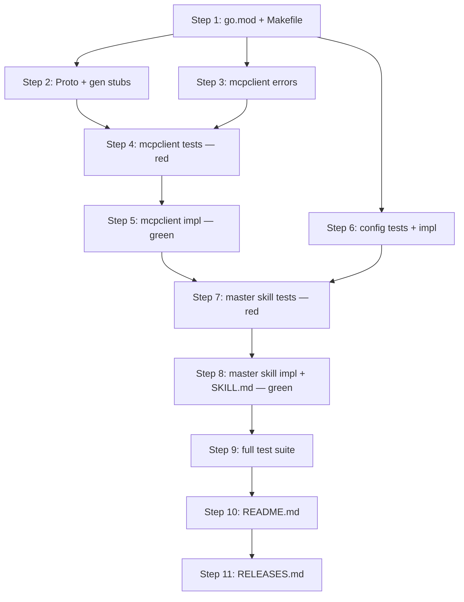

# Implementation Plan: MCP gRPC Connection Client

**Sprint**: SP-001
**Created**: 2026-06-28
**Spec**: SPEC.md
**Status**: Ready for Implementation

## Summary

This plan delivers the foundational gRPC client infrastructure (`internal/mcpclient/`) and the master skill (`skills/master/`) that connects the Eve Realm CLI to the MCP Server's tool registry. The client library introduces the project's first gRPC dependency — proto definition, generated stubs, typed errors, and a config resolver — while the master skill wires everything together so Claude Code can discover and invoke any registered MCP tool through a single marketplace entry point. All eleven entities (REQ-004, REQ-005, SC-003 through SC-00B) are covered across nine implementation steps plus documentation.

## Entity Coverage

| Entity | Type | Partial | Scope |
|--------|------|---------|-------|
| REQ-004 | requirement | no | Full implementation |
| REQ-005 | requirement | no | Full implementation |
| SC-003 | scenario | no | Full implementation |
| SC-004 | scenario | no | Full implementation |
| SC-005 | scenario | no | Full implementation |
| SC-006 | scenario | no | Full implementation |
| SC-007 | scenario | no | Full implementation |
| SC-008 | scenario | no | Full implementation |
| SC-009 | scenario | no | Full implementation |
| SC-00A | scenario | no | Full implementation |
| SC-00B | scenario | no | Full implementation |

## Implementation Steps

### Step 1: Go module dependencies and Makefile proto target

**Description**: Extend `go.mod` to declare the three new module dependencies (`google.golang.org/grpc`, `google.golang.org/protobuf`, `gopkg.in/yaml.v3`) and update `go.sum` by running `go get`. Extend `Makefile` with a `proto` target (via `buf generate` or `protoc`) and add `proto` to the `.PHONY` list. This step unblocks all subsequent steps that import gRPC or YAML packages.
**Entities**: REQ-004, REQ-005
**Files to modify**:
- `go.mod` (modify)
- `go.sum` (create)
- `Makefile` (modify)
**Acceptance criteria**:
- [ ] `go.mod` declares `google.golang.org/grpc`, `google.golang.org/protobuf`, and `gopkg.in/yaml.v3` as direct dependencies with resolved versions
- [ ] `go.sum` exists and contains checksums for all new dependencies
- [ ] `Makefile` contains a `proto` target that invokes `buf generate` (or `protoc` + plugins) to generate Go stubs from `proto/mcp/v1/mcp.proto`
- [ ] `proto` appears in the `.PHONY` declaration
- [ ] `make build` still succeeds after the dependency additions (no import errors)
**Estimated complexity**: S
**Depends on**: None

---

### Step 2: Proto definition and generated gRPC stubs

**Description**: Author `proto/mcp/v1/mcp.proto` defining `MCPService` with two RPCs — `ListTools` (empty request, returns a list of tool descriptors with `name`, `description`, and `input_schema`) and `InvokeTool` (tool name + JSON input string, returns JSON output string). Create `buf.yaml` for buf toolchain configuration. Generate (or hand-author) the Go stubs in `gen/proto/mcp/v1/`. These generated files are the dependency of `internal/mcpclient/client.go` and must exist before the client package is written.
**Entities**: REQ-004
**Files to modify**:
- `proto/mcp/v1/mcp.proto` (create)
- `buf.yaml` (create)
- `gen/proto/mcp/v1/mcp.pb.go` (create)
- `gen/proto/mcp/v1/mcp_grpc.pb.go` (create)
**Acceptance criteria**:
- [ ] `proto/mcp/v1/mcp.proto` defines the `MCPService` service with `ListTools` and `InvokeTool` RPCs
- [ ] The `ListTools` RPC uses an empty request message and returns a response containing a repeated field of tool descriptors, each with `name`, `description`, and `input_schema` string fields
- [ ] The `InvokeTool` RPC accepts a request with `name` and `input` string fields and returns a response with an `output` string field
- [ ] `gen/proto/mcp/v1/mcp.pb.go` and `gen/proto/mcp/v1/mcp_grpc.pb.go` exist and compile cleanly (`go build ./gen/...`)
- [ ] `make proto` executes without error (or generated files are committed and `make proto` is documented as requiring optional toolchain)
- [ ] `buf.yaml` is present and configures the module root correctly
**Estimated complexity**: M
**Depends on**: Step 1

---

### Step 3: mcpclient typed errors

**Description**: Create `internal/mcpclient/errors.go` defining the `ConnectionError` and `ToolNotFoundError` concrete structs. Both must implement the `error` interface and support `errors.As` detection. `ConnectionError` must carry the server address string. `ToolNotFoundError` must carry the tool name string. This step is isolated so the error types can be imported by both the client and the test file without circular dependencies. Writing the error types first follows the TDD red-phase: the test file can reference these types before the client logic exists.
**Entities**: REQ-004, SC-005, SC-006
**Files to modify**:
- `internal/mcpclient/errors.go` (create)
**Acceptance criteria**:
- [ ] `ConnectionError` is a struct with at least an `Addr string` field and an `Error() string` method whose output includes the address
- [ ] `ToolNotFoundError` is a struct with at least a `Name string` field and an `Error() string` method whose output includes the tool name
- [ ] Both types satisfy the `error` interface
- [ ] `errors.As(connectionErr, &ConnectionError{})` returns `true`
- [ ] `errors.As(toolNotFoundErr, &ToolNotFoundError{})` returns `true`
- [ ] `errors.As(connectionErr, &ToolNotFoundError{})` returns `false` (types are distinguishable)
- [ ] Package compiles cleanly (`go build ./internal/mcpclient/`)
**Estimated complexity**: S
**Depends on**: Step 1

---

### Step 4: mcpclient unit tests (TDD red phase)

**Description**: Write `internal/mcpclient/client_test.go` as table-driven tests covering SC-003, SC-004, SC-005, and SC-006 using a bufconn in-process gRPC server. All test cases are written against the `Client` interface that does not yet exist — tests must fail to compile or fail at runtime at this point (red phase). Test function names follow the `TestFunctionName_Scenario` convention. No external assertion libraries are used.
**Entities**: REQ-004, SC-003, SC-004, SC-005, SC-006
**Files to modify**:
- `internal/mcpclient/client_test.go` (create)
**Acceptance criteria**:
- [ ] Test file is present and references the `mcpclient` package types: `Client`, `NewClient`, `ListTools`, `InvokeTool`, `Tool`, `ConnectionError`, `ToolNotFoundError`
- [ ] Test `TestListTools_ReturnsToolsFromServer` asserts `ListTools` returns a `[]Tool` slice with at least one entry, each with non-empty `Name`, `Description`, and `InputSchema` — covers SC-003
- [ ] Test `TestInvokeTool_ReturnsPongResponse` asserts `InvokeTool("ping", "{}")` returns valid non-empty JSON with no error — covers SC-004
- [ ] Tests `TestListTools_ConnectionError` and `TestInvokeTool_ConnectionError` assert that calling either method on an unreachable address (`localhost:59999`) returns an error where `errors.As(err, &ConnectionError{})` is true and the error message contains the address — covers SC-005
- [ ] Test `TestInvokeTool_ToolNotFoundError` asserts `InvokeTool("nonexistent", "{}")` against a bufconn server that returns gRPC `NOT_FOUND` yields an error where `errors.As(err, &ToolNotFoundError{})` is true, `errors.As(err, &ConnectionError{})` is false, and the message includes `"nonexistent"` — covers SC-006
- [ ] Test `TestNewClient_DefaultAddress` verifies `DefaultMCPAddr` constant equals `"localhost:30051"` and that `NewClient("")` uses it — covers AC-6
- [ ] All tests use `bufconn` or a known-unused local port; no external network
- [ ] No testify or external assertion libraries imported

**Test Expectations (from SPEC)**:
- Must test: `ListTools` returns a non-empty `[]Tool` slice when server has tools registered — each entry has non-empty `name`, `description`, and `input_schema` (SC-003, AC-2). Uses bufconn in-process server.
- Must test: `InvokeTool` with a valid tool name and `"{}"` input returns a non-empty JSON string and no error (SC-004, AC-3). Uses bufconn in-process server.
- Must test: `ListTools` and `InvokeTool` return a `ConnectionError` (detectable via `errors.As`) when the server address is unreachable (SC-005, AC-4). Uses `localhost:59999` or equivalent unused port.
- Must test: `InvokeTool` with an unknown tool name returns a `ToolNotFoundError` (detectable via `errors.As`) and not a `ConnectionError` (SC-006, AC-5). Uses bufconn server that responds with gRPC `NOT_FOUND`.
- Must test: `NewClient("")` connects to `localhost:30051`; `NewClient("localhost:9999")` connects to the given address (AC-6). Verified via the default constant, not by actually connecting.
- Must test: `ToolNotFoundError` message includes the tool name that was not found (SC-006 expected result).
- Must NOT rely on: external network — all tests use bufconn or a known-unused port. No testify or external assertion libraries. No global test state.

**Testing Approach**: TDD

**Estimated complexity**: M
**Depends on**: Step 3

---

### Step 5: mcpclient client implementation (TDD green phase)

**Description**: Create `internal/mcpclient/client.go` implementing the `Client` type, `Tool` struct, `NewClient(addr string)` constructor, `ListTools(ctx context.Context) ([]Tool, error)` method, and `InvokeTool(ctx context.Context, name, input string) (string, error)` method. Declare `const DefaultMCPAddr = "localhost:30051"`. The implementation wraps gRPC dial and RPC errors into `ConnectionError` and `ToolNotFoundError` as appropriate. All tests written in Step 4 must pass after this step (green phase).
**Entities**: REQ-004, SC-003, SC-004, SC-005, SC-006
**Files to modify**:
- `internal/mcpclient/client.go` (create)
**Acceptance criteria**:
- [ ] `Client` type exposes `ListTools(ctx context.Context) ([]Tool, error)` and `InvokeTool(ctx context.Context, name, input string) (string, error)` — satisfies AC-1
- [ ] `NewClient("")` sets the dial target to `DefaultMCPAddr` (`"localhost:30051"`); non-empty address is used as-is — satisfies AC-6
- [ ] `ListTools` calls the `MCPService.ListTools` gRPC RPC and maps the response to a `[]Tool` slice — satisfies AC-2
- [ ] `InvokeTool` calls the `MCPService.InvokeTool` gRPC RPC and returns the `output` field as a string — satisfies AC-3
- [ ] gRPC `codes.Unavailable` and dial errors are wrapped into `ConnectionError` carrying the address — satisfies AC-4
- [ ] gRPC `codes.NotFound` response from `InvokeTool` is wrapped into `ToolNotFoundError` carrying the tool name — satisfies AC-5
- [ ] `go test ./internal/mcpclient/...` passes with all tests green
- [ ] `go build ./internal/mcpclient/` compiles without errors

**Test Expectations (from SPEC)**:
- Must test: `ListTools` returns a non-empty `[]Tool` slice when server has tools registered — each entry has non-empty `name`, `description`, and `input_schema` (SC-003, AC-2). Uses bufconn in-process server.
- Must test: `InvokeTool` with a valid tool name and `"{}"` input returns a non-empty JSON string and no error (SC-004, AC-3). Uses bufconn in-process server.
- Must test: `ListTools` and `InvokeTool` return a `ConnectionError` (detectable via `errors.As`) when the server address is unreachable (SC-005, AC-4). Uses `localhost:59999` or equivalent unused port.
- Must test: `InvokeTool` with an unknown tool name returns a `ToolNotFoundError` (detectable via `errors.As`) and not a `ConnectionError` (SC-006, AC-5). Uses bufconn server that responds with gRPC `NOT_FOUND`.
- Must test: `NewClient("")` connects to `localhost:30051`; `NewClient("localhost:9999")` connects to the given address (AC-6). Verified via the default constant, not by actually connecting.
- Must test: `ToolNotFoundError` message includes the tool name that was not found (SC-006 expected result).
- Must NOT rely on: external network — all tests use bufconn or a known-unused port. No testify or external assertion libraries. No global test state.

**Testing Approach**: TDD

**Estimated complexity**: M
**Depends on**: Step 4

---

### Step 6: Config package — tests and implementation (TDD, both phases)

**Description**: Create `internal/config/config.go` defining the `HostConfig` struct (with `MCPServerAddr string` YAML-tagged field), `LoadHostConfig(path string)` (returns zero-value on missing file, no error), and `Resolve(envKey, yamlValue string) string` (env var overrides YAML value). Immediately follow with `internal/config/config_test.go` covering YAML round-trip, env var overlay, and missing-file behavior. Because this package has no upstream Go dependency on the mcpclient (it is pure YAML + env logic), tests and implementation can be developed together in a single step without violating TDD ordering — write each test case before its corresponding implementation branch.
**Entities**: REQ-005
**Files to modify**:
- `internal/config/config.go` (create)
- `internal/config/config_test.go` (create)
**Acceptance criteria**:
- [ ] `HostConfig` struct has `MCPServerAddr string \`yaml:"mcp_server_addr"\`` field
- [ ] `LoadHostConfig(path)` reads `mcp_server_addr` from a YAML file at the given path and returns a populated `HostConfig`
- [ ] `LoadHostConfig(path)` returns a zero-value `HostConfig` and nil error when the file does not exist
- [ ] `Resolve(envKey, yamlValue)` returns the value of `os.Getenv(envKey)` when the env var is non-empty, otherwise returns `yamlValue`
- [ ] Test `TestLoadHostConfig_YAMLRoundTrip` writes a temp YAML file via `t.TempDir()` and asserts the loaded value matches
- [ ] Test `TestResolve_EnvVarOverridesYAML` sets `EVE_REALM_MCP_ADDR` via `t.Setenv` and asserts `Resolve` returns the env var value
- [ ] Test `TestLoadHostConfig_MissingFile` asserts that a nonexistent path returns zero-value `HostConfig` and nil error
- [ ] `go test ./internal/config/...` passes with all tests green
- [ ] Uses `gopkg.in/yaml.v3` for YAML decoding with struct tags

**Test Expectations (from SPEC)**:
- Must test: Config loading reads `mcp_server_addr` from YAML, env var `EVE_REALM_MCP_ADDR` overrides YAML, and missing config file is a non-error condition returning zero-value (AC-7). Uses `t.TempDir()` for YAML round-trip tests.
- Must NOT rely on: external network; external assertion libraries; global test state.

**Testing Approach**: TDD

**Estimated complexity**: S
**Depends on**: Step 1

---

### Step 7: Master skill unit tests (TDD red phase)

**Description**: Write `skills/master/skill_test.go` covering SC-007, SC-008, SC-009, and SC-00A using a `mockMCPClient` interface. The mock implements the same interface that `skill.go` will accept via dependency injection. Also write the SC-00B integration test using a bufconn in-process gRPC server (the one test that exercises the real client code end-to-end). Tests must fail at compile time since `skills/master/skill.go` does not yet exist (red phase).
**Entities**: REQ-005, SC-007, SC-008, SC-009, SC-00A, SC-00B
**Files to modify**:
- `skills/master/skill_test.go` (create)
**Acceptance criteria**:
- [ ] `mockMCPClient` struct implements a `MCPClient` interface with `ListTools` and `InvokeTool` methods, configurable per test case
- [ ] Test `TestDiscoveryMode_ListsAllTools` asserts that invoking the skill without arguments returns text containing each tool's name, description, and input schema — covers SC-007
- [ ] Test `TestInvocationMode_ReturnsPongResponse` asserts that invoking the skill with `"ping"` and empty input returns the raw JSON string from `mockMCPClient.InvokeTool` with no modification — covers SC-008
- [ ] Tests `TestDiscoveryMode_ConnectionError` and `TestInvocationMode_ConnectionError` assert that when the mock returns a `ConnectionError`, the skill output is a user-friendly string containing the server address and no gRPC error codes — covers SC-009
- [ ] Test `TestInvocationMode_ToolNotFound` asserts that when the mock returns a `ToolNotFoundError` for `"nonexistent"`, the skill output contains the string `"nonexistent"` and lists available tool names (`"ping"`, `"echo"`) — covers SC-00A
- [ ] Integration test `TestEndToEnd_PingViaMasterSkill` uses a real bufconn in-process server, constructs the skill with `NewClient(bufconnAddr)`, invokes it with `"ping"`, and asserts the response is valid JSON with `message == "pong"` and a parseable RFC 3339 timestamp within a reasonable window of `time.Now()` — covers SC-00B
- [ ] No testify or external assertion libraries; no external network; no global test state

**Test Expectations (from SPEC)**:
- Must test: Discovery mode (no args) calls `ListTools` and returns formatted text containing tool names, descriptions, and input schemas — all registered tools present (SC-007, AC-2). Uses `mockMCPClient` interface.
- Must test: Invocation mode (tool name + input) calls `InvokeTool` and returns the raw JSON response string with no additional formatting (SC-008, AC-3). Uses `mockMCPClient`.
- Must test: When `mockMCPClient.ListTools` or `mockMCPClient.InvokeTool` returns a `ConnectionError`, the skill returns a user-friendly message containing the server address, with no gRPC error codes or stack traces (SC-009, AC-4). Uses `mockMCPClient`.
- Must test: When `mockMCPClient.InvokeTool` returns a `ToolNotFoundError` for tool `"nonexistent"`, the skill response includes the tool name and lists available alternatives (SC-00A, AC-5). Uses `mockMCPClient`.
- Must test: End-to-end — invoking the skill with tool `"ping"` against a bufconn in-process server returns `{"message": "pong", "timestamp": "..."}` with valid JSON and a recent timestamp (SC-00B, AC-8).
- Must NOT rely on: external network — all tests use `mockMCPClient` or bufconn. No testify or external assertion libraries. No global test state.

**Testing Approach**: TDD

**Estimated complexity**: M
**Depends on**: Step 5, Step 6

---

### Step 8: Master skill implementation and SKILL.md (TDD green phase)

**Description**: Create `skills/master/skill.go` implementing discovery mode (no-arg invocation calls `ListTools` and formats results for AI consumption) and invocation mode (tool-name arg calls `InvokeTool` and returns raw JSON). The skill accepts the gRPC client via a `MCPClient` interface. It detects `ConnectionError` via `errors.As` to produce a user-friendly message including the server address, and detects `ToolNotFoundError` via `errors.As` to call `ListTools` for alternatives and include them in the response. Config is loaded from `internal/config` (env var `EVE_REALM_MCP_ADDR` > YAML `mcp_server_addr` > `NewClient("")` default). Also create `skills/master/SKILL.md` with valid YAML frontmatter. All tests from Step 7 must pass after this step (green phase).
**Entities**: REQ-005, SC-007, SC-008, SC-009, SC-00A, SC-00B
**Files to modify**:
- `skills/master/skill.go` (create)
- `skills/master/SKILL.md` (create)
**Acceptance criteria**:
- [ ] `SKILL.md` contains valid YAML frontmatter with `description`, `argument-hint`, and `disable-model-invocation` fields — satisfies AC-1
- [ ] Discovery mode (no arguments) calls `ListTools` and returns formatted text with each tool's name, description, and input schema — satisfies AC-2 and SC-007
- [ ] Invocation mode (tool name + input provided) calls `InvokeTool` and returns the raw JSON response string with no added formatting — satisfies AC-3 and SC-008
- [ ] When `errors.As(err, &ConnectionError{})` is true, the skill returns a message of the form `"MCP Server is not available at <address>. Check that the server is running."` with no Go error strings or gRPC status codes — satisfies AC-4 and SC-009
- [ ] When `errors.As(err, &ToolNotFoundError{})` is true, the skill calls `ListTools`, formats the available tool names, and returns a message stating the named tool was not found plus the alternatives list — satisfies AC-5 and SC-00A
- [ ] Config resolution follows: env var `EVE_REALM_MCP_ADDR` > YAML `mcp_server_addr` > `NewClient("")` (defaults to `localhost:30051`) — satisfies AC-7
- [ ] End-to-end via bufconn: invoking with `"ping"` returns JSON with `message == "pong"` and a parseable RFC 3339 timestamp — satisfies AC-8 and SC-00B
- [ ] `go test ./skills/master/...` passes with all tests green
- [ ] All skill logic resides in `skills/master/` — satisfies AC-6

**Test Expectations (from SPEC)**:
- Must test: Discovery mode (no args) calls `ListTools` and returns formatted text containing tool names, descriptions, and input schemas — all registered tools present (SC-007, AC-2). Uses `mockMCPClient` interface.
- Must test: Invocation mode (tool name + input) calls `InvokeTool` and returns the raw JSON response string with no additional formatting (SC-008, AC-3). Uses `mockMCPClient`.
- Must test: When `mockMCPClient.ListTools` or `mockMCPClient.InvokeTool` returns a `ConnectionError`, the skill returns a user-friendly message containing the server address, with no gRPC error codes or stack traces (SC-009, AC-4). Uses `mockMCPClient`.
- Must test: When `mockMCPClient.InvokeTool` returns a `ToolNotFoundError` for tool `"nonexistent"`, the skill response includes the tool name and lists available alternatives (SC-00A, AC-5). Uses `mockMCPClient`.
- Must test: End-to-end — invoking the skill with tool `"ping"` against a bufconn in-process server returns `{"message": "pong", "timestamp": "..."}` with valid JSON and a recent timestamp (SC-00B, AC-8).
- Must NOT rely on: external network — all tests use `mockMCPClient` or bufconn. No testify or external assertion libraries. No global test state.

**Testing Approach**: TDD

**Estimated complexity**: L
**Depends on**: Step 7

---

### Step 9: Full test suite verification

**Description**: Run the complete test suite (`go test -count=1 ./...`) and confirm all packages compile and all tests pass — including the bufconn integration test in `skills/master/skill_test.go` (SC-00B). This verification step confirms REQ-004 and REQ-005 are fully implemented and all eleven scenarios are covered. No new files are created; this step resolves any inter-package compilation issues surfaced when all packages are built together.
**Entities**: REQ-004, REQ-005, SC-003, SC-004, SC-005, SC-006, SC-007, SC-008, SC-009, SC-00A, SC-00B
**Files to modify**:
- N/A (verification only; fix any compilation or test failures in place)
**Acceptance criteria**:
- [ ] `go build ./...` exits 0 with no errors or warnings
- [ ] `go test -count=1 ./...` exits 0 with all tests passing (no FAIL lines)
- [ ] `go test -count=1 ./internal/mcpclient/...` covers SC-003, SC-004, SC-005, SC-006
- [ ] `go test -count=1 ./internal/config/...` covers AC-7 config resolution cases
- [ ] `go test -count=1 ./skills/master/...` covers SC-007, SC-008, SC-009, SC-00A, SC-00B
- [ ] No external network calls in any test
- [ ] `make build` produces `dist/eve-realm` successfully
**Estimated complexity**: S
**Depends on**: Step 8

---

### Step 10: README.md Update

**Description**: Update `README.md` to document the user-facing changes introduced in SP-001: the master skill registration procedure, MCP Server address configuration options, and the new `make proto` command.
**Entities**: REQ-004, REQ-005
**Files to modify**:
- `README.md` (modify)
**Acceptance criteria**:
- [ ] README.md documents the `skills/master/` skill registered as `eve-realm` in the marketplace and its purpose (list and invoke any MCP Server tool)
- [ ] README.md documents the `extraKnownMarketplaces` manual registration step for `~/.claude/settings.json` with enough detail for a developer to complete it
- [ ] README.md documents the two MCP Server address configuration mechanisms: `mcp_server_addr` in `~/.eve-realm/eve-realm.yaml` and the `EVE_REALM_MCP_ADDR` environment variable, with the default of `localhost:30051`
- [ ] README.md documents the `make proto` command and its purpose (regenerate Go stubs from `proto/mcp/v1/mcp.proto`)
- [ ] README.md is consistent with the implementation (addresses, file paths, and command names match)
**Estimated complexity**: S
**Depends on**: Step 9

---

### Step 11: RELEASES.md Append

**Description**: Append a release entry to `RELEASES.md` documenting the SP-001 delivery. The file does not currently exist and must be created with the initial entry. The entry must include the sprint ID and title, date, a 2–3 sentence summary of changes, and all eleven entity IDs delivered.
**Entities**: REQ-004, REQ-005, SC-003, SC-004, SC-005, SC-006, SC-007, SC-008, SC-009, SC-00A, SC-00B
**Files to modify**:
- `RELEASES.md` (create)
**Acceptance criteria**:
- [ ] `RELEASES.md` exists with a new entry for SP-001
- [ ] Entry includes the sprint ID `SP-001` and title `MCP gRPC Connection Client`
- [ ] Entry includes the completion date
- [ ] Entry lists all entity IDs: REQ-004, REQ-005, SC-003, SC-004, SC-005, SC-006, SC-007, SC-008, SC-009, SC-00A, SC-00B
- [ ] Entry summarizes the changes in 2–3 sentences: gRPC client library, master skill, config resolver, proto definition and generated stubs, Makefile proto target
**Estimated complexity**: S
**Depends on**: Step 10

---

## Step Dependency Graph

Steps 2, 3, and 6 can be executed in parallel after Step 1 completes.

---

## Pinned Entity Compliance

| Entity | Directive | How Addressed |
|--------|-----------|---------------|
| REQ-003: Cross-cutting requirements catalog for lazy-loaded sprint policy injection | Mandatory loading rule: trigger "Implementing or modifying Go code" matches this sprint — REQ-001 (TDD) must be loaded before proceeding. REQ-002 trigger (sprint completion/release) does not apply to the plan phase. | REQ-001 (`testing_strategy: tdd`) trigger matched. TDD ordering applied: test steps (Steps 4 and 7, red phase) precede their corresponding implementation steps (Steps 5 and 8, green phase). Config package (Step 6) combines both phases in one step given its self-contained nature. Test Expectations from SPEC propagated to Steps 4, 5, 7, and 8. Testing Approach field annotated as TDD on all applicable steps. REQ-002 deferred — no plan-phase action required for release process. |
