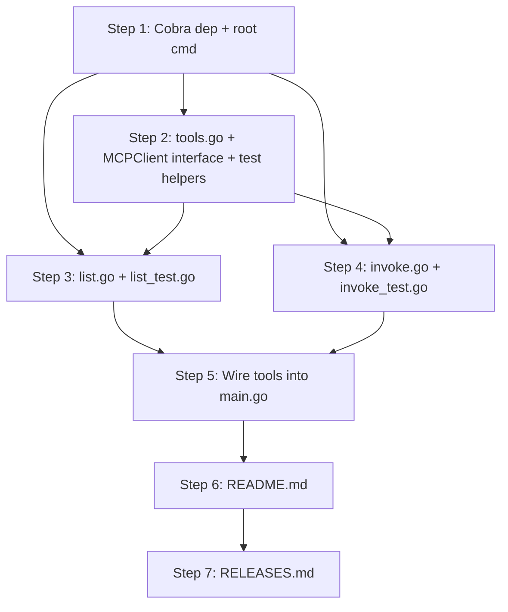

# Implementation Plan: Cobra command for MCP tool listing and invocation

**Sprint**: SP-003
**Created**: 2026-06-30
**Spec**: SPEC.md
**Status**: Ready for Implementation

## Summary

This plan delivers the `eve-realm tools` Cobra command group, exposing `list` and `invoke` subcommands that interact with the MCP Server's tool registry via the gRPC client established in SP-001. It also introduces Cobra as the root command framework, replacing the bare argument parser in `cmd/main.go`, and adds the required Cobra dependency to `go.mod`. All implementation steps follow TDD order: tests are written before the production code they verify.

## Entity Coverage

| Entity  | Type        | Partial | Scope                  |
|---------|-------------|---------|------------------------|
| REQ-006 | requirement | no      | Full implementation    |
| SC-012  | scenario    | no      | Full implementation    |
| SC-013  | scenario    | no      | Full implementation    |
| SC-014  | scenario    | no      | Full implementation    |
| SC-015  | scenario    | no      | Full implementation    |
| SC-016  | scenario    | no      | Full implementation    |
| SC-017  | scenario    | no      | Full implementation    |

## Implementation Steps

### Step 1: Add Cobra dependency and replace cmd/main.go with Cobra root command

**Description**: Run `go get github.com/spf13/cobra` to add the dependency to `go.mod` and `go.sum`. Then replace the existing 21-line bare argument parser in `cmd/main.go` with a Cobra root command that preserves the `version` subcommand behavior and sets `SilenceErrors = true`. This is a prerequisite for all `cmd/tools/` work and must complete before any subcommand is registered.

**Entities**: REQ-006

**Files to modify**:
- `go.mod` (modify — add `github.com/spf13/cobra`)
- `go.sum` (modify — updated by `go get`)
- `cmd/main.go` (modify — replace bare arg parser with Cobra root command)

**Acceptance criteria**:
- [ ] `go.mod` contains a `require` entry for `github.com/spf13/cobra`
- [ ] `cmd/main.go` declares a Cobra root command with `SilenceErrors = true`
- [ ] `eve-realm version` continues to print the version string (behavior preserved from the old parser)
- [ ] `make build` succeeds with no compile errors
- [ ] `make test` passes with no regressions on existing tests

**Estimated complexity**: S

**Depends on**: None

**Test Expectations (from SPEC)**: N/A — this step is infrastructure wiring (dependency addition and entry-point replacement). No new logic is introduced; existing `cmd/main_test.go` and all other tests must continue to pass.

**Testing Approach**: TDD

---

### Step 2: Implement cmd/tools/tools.go with MCPClient interface and NewToolsCmd factory (TDD)

**Description**: Create the `cmd/tools/` package with `tools.go` defining the local `MCPClient` interface (`ListTools` + `InvokeTool` method signatures) and the `NewToolsCmd(configPath string) *cobra.Command` factory. The factory resolves the MCP Server address via `config.LoadHostConfig` → `config.Resolve("EVE_REALM_MCP_ADDR", ...)` → fallback to `mcpclient.DefaultMCPAddr`, constructs an `mcpclient.Client`, then registers the `list` and `invoke` subcommands. Also create `cmd/tools/tools_test.go` with the shared `runToolsCmd` helper and `mockMCPClient` struct used by all tools tests. Following TDD, write the test helpers and mock before finalizing the factory.

**Entities**: REQ-006, SC-017

**Files to modify**:
- `cmd/tools/tools.go` (create — `MCPClient` interface + `NewToolsCmd` factory)
- `cmd/tools/tools_test.go` (create — `runToolsCmd` helper + `mockMCPClient` struct)

**Acceptance criteria**:
- [ ] `cmd/tools/tools.go` compiles and exports `NewToolsCmd(configPath string) *cobra.Command`
- [ ] The `MCPClient` interface in `cmd/tools/` declares `ListTools(ctx context.Context) ([]mcpclient.Tool, error)` and `InvokeTool(ctx context.Context, name, input string) (string, error)`
- [ ] `mockMCPClient` in `tools_test.go` has function fields for `ListToolsFn` and `InvokeToolFn` and satisfies the local `MCPClient` interface
- [ ] `runToolsCmd(t, args...)` helper sets up the root command with an injected mock and captures stdout/stderr buffers
- [ ] `make test ./cmd/tools/...` passes (test file compiles and shared helpers are exercisable)

**Estimated complexity**: S

**Depends on**: Step 1

**Test Expectations (from SPEC)**:
- Must NOT rely on: Real gRPC connections or real filesystem paths for any test. All MCP client calls must go through the injected `mockMCPClient`. Config file reads must use `t.TempDir()`-scoped paths.

**Testing Approach**: TDD

---

### Step 3: Implement cmd/tools/list.go — tools list command (TDD)

**Description**: Following TDD, first write `cmd/tools/list_test.go` with the full test suite for `tools list`, then implement `cmd/tools/list.go` containing `newListCmd(client MCPClient) *cobra.Command` to make those tests pass. The command calls `client.ListTools`, formats each tool's name, description, and input schema to `cmd.OutOrStdout()`, and routes errors to `cmd.ErrOrStderr()`. Address resolution tests for SC-017 also live in this file. Refactor after green.

**Entities**: REQ-006, SC-012, SC-015, SC-017

**Files to modify**:
- `cmd/tools/list_test.go` (create — full test suite for `tools list`)
- `cmd/tools/list.go` (create — `newListCmd` implementation)

**Acceptance criteria**:
- [ ] `tools list` with a mock returning two tools (`ping`, `echo`) exits 0 and stdout contains each tool's name, description, and input schema
- [ ] `tools list` with a mock returning one tool exits 0 and stdout contains only that tool's data (no extra blank entries)
- [ ] `tools list` with a mock returning zero tools exits 0 with graceful (non-crashing) output
- [ ] `tools list` with mock returning `ConnectionError` exits non-zero; stderr contains an error message; stdout is empty
- [ ] Address resolution table test passes: (1) env var `EVE_REALM_MCP_ADDR` set — env var value used; (2) env var unset, YAML file present — YAML value used; (3) env var unset, YAML absent — `localhost:30051` used; each case uses `t.TempDir()` and `t.Setenv()`
- [ ] Output format is human-readable and consistent (each tool section separated, no raw struct printing)
- [ ] `make test ./cmd/tools/...` passes

**Estimated complexity**: M

**Depends on**: Step 2

**Test Expectations (from SPEC)**:
- Must test: Mock returns two tools (`ping`, `echo`) — stdout contains both names, both descriptions, and both input schema strings; exit code is 0.
- Must test: Mock returns one tool — stdout contains that tool's name, description, input schema; no extra blank tool entries.
- Must test: Output structure is consistent — each tool section is separated and readable (no raw struct printing).
- Must test: `tools list` with mock returning `ConnectionError` — `cmd.Execute()` returns non-nil error; stderr contains error text; stdout is empty.
- Must test: Error message in stderr is user-readable (not a raw Go error struct string).
- Must test: Table-driven with three rows — env-var-wins, yaml-wins, default-used. Each row uses a temp config file (via `t.TempDir()`) and controls env var state via `t.Setenv()`.
- Must test: Env var set + YAML file present → env var value is used (YAML value ignored).
- Must test: Env var unset + YAML file with `mcp_server_addr` → YAML value is used.
- Must test: Env var unset + YAML file absent (or field missing) → `localhost:30051` is used.
- Must NOT rely on: Real MCP Server connection. All calls go through `mockMCPClient`. Config file reads must use `t.TempDir()`-scoped paths.

**Testing Approach**: TDD

---

### Step 4: Implement cmd/tools/invoke.go — tools invoke command (TDD)

**Description**: Following TDD, first write `cmd/tools/invoke_test.go` with the full test suite for `tools invoke`, then implement `cmd/tools/invoke.go` containing `newInvokeCmd(client MCPClient) *cobra.Command` to make those tests pass. The command accepts a positional tool-name argument, a `--input` string flag defaulting to `{}`, calls `client.InvokeTool`, writes the JSON response to `cmd.OutOrStdout()`, and routes errors (including the SC-016 secondary `ListTools` alternatives listing) to `cmd.ErrOrStderr()`. Refactor after green.

**Entities**: REQ-006, SC-013, SC-014, SC-015, SC-016

**Files to modify**:
- `cmd/tools/invoke_test.go` (create — full test suite for `tools invoke`)
- `cmd/tools/invoke.go` (create — `newInvokeCmd` implementation)

**Acceptance criteria**:
- [ ] `tools invoke ping` (no `--input`) exits 0; mock verifies `InvokeTool` called with `{}` as input; stdout contains the mock's JSON response
- [ ] `tools invoke echo --input '{"key":"value"}'` exits 0; mock captures input argument and it equals `{"key":"value"}` byte-for-byte; stdout contains the mock's JSON response
- [ ] `tools invoke echo --input '{}'` explicit empty object exits 0; mock receives `{}` identical to the default behavior
- [ ] `--input` with nested JSON is passed verbatim without re-serialization
- [ ] `tools invoke ping` with mock returning `ConnectionError` exits non-zero; stderr contains error message; stdout is empty
- [ ] `tools invoke unknown-tool` with mock `InvokeTool` returning `ToolNotFoundError` and secondary `ListTools` returning `["ping","echo"]` exits non-zero; stderr contains the not-found message and both alternative tool names; stdout is empty
- [ ] `tools invoke unknown-tool` when secondary `ListTools` also fails exits non-zero; stderr contains the original not-found error; no panic
- [ ] `tools invoke unknown-tool` with zero alternatives from `ListTools` exits non-zero; stderr contains not-found message; no crash
- [ ] `make test ./cmd/tools/...` passes

**Estimated complexity**: M

**Depends on**: Step 2

**Test Expectations (from SPEC)**:
- Must test: No `--input` flag provided — mock verifies `InvokeTool` called with `{}` as input string; stdout contains the mock's JSON response; exit code 0.
- Must test: Mock `InvokeTool` returns a multi-field JSON object — stdout contains the exact JSON string returned by the mock.
- Must test: `--input '{"key":"value"}'` — mock captures the input argument, assert it equals `{"key":"value"}` byte-for-byte; exit code 0.
- Must test: `--input '{}'` explicit empty object — mock receives `{}` (same as default, but explicitly set); behavior is identical.
- Must test: `--input` with nested JSON — input containing nested structures is passed verbatim without re-serialization.
- Must test: `tools invoke <name>` with mock returning `ConnectionError` — `cmd.Execute()` returns non-nil error; stderr contains error text; stdout is empty.
- Must test: `tools invoke unknown-tool` with `InvokeTool` returning `ToolNotFoundError` and `ListTools` returning `["ping", "echo"]` — stderr contains "unknown-tool" (or not-found text), "ping", and "echo"; exit non-zero; stdout empty.
- Must test: Secondary `ListTools` call fails (returns `ConnectionError`) — stderr still contains the original not-found error; command still exits non-zero.
- Must test: Tool not found with zero alternatives available (empty list from `ListTools`) — stderr contains not-found message; no crash or panic.
- Must NOT rely on: Real MCP Server. Both `InvokeTool` and the secondary `ListTools` call in the same test use configurable mock function fields.

**Testing Approach**: TDD

---

### Step 5: Wire tools subcommand into cmd/main.go and verify full integration

**Description**: Register `NewToolsCmd` into the Cobra root command in `cmd/main.go` and verify the complete command tree compiles and all tests pass end-to-end. This step also ensures `SilenceErrors = true` is confirmed on the root (preventing double-printing for error scenarios) and that `cmd/main.go` wiring follows the constructor pattern with the default config file path `~/.eve-realm/eve-realm.yaml`.

**Entities**: REQ-006, SC-012, SC-013, SC-014, SC-015, SC-016, SC-017

**Files to modify**:
- `cmd/main.go` (modify — add `tools` subcommand via `rootCmd.AddCommand(tools.NewToolsCmd(defaultConfigPath))`)

**Acceptance criteria**:
- [ ] `make build` succeeds — binary compiles with `eve-realm tools` available in the command tree
- [ ] `make test` passes — all tests across `cmd/`, `internal/`, and `skills/` are green with no regressions
- [ ] `SilenceErrors = true` is set on the root command in `cmd/main.go`
- [ ] Default config path passed to `NewToolsCmd` resolves to `~/.eve-realm/eve-realm.yaml` (via `os.UserHomeDir` at startup, not hardcoded)
- [ ] `eve-realm tools --help` outputs usage text listing `list` and `invoke` subcommands (verifiable from the built binary)

**Estimated complexity**: S

**Depends on**: Step 1, Step 2, Step 3, Step 4

**Test Expectations (from SPEC)**: Integration compilation and regression gate. No new test cases; all previously written tests must pass together.

**Testing Approach**: TDD

---

### Step 6: README.md Update

**Description**: Update `README.md` to document the new `eve-realm tools` command group. Add sections covering `eve-realm tools list` (usage, output format — tool name, description, input schema, when to use it), `eve-realm tools invoke <name> [--input <json>]` (positional argument, `--input` flag default of `{}`, JSON response output), and the MCP Server address configuration three-layer precedence (`EVE_REALM_MCP_ADDR` env var → `mcp_server_addr` in `~/.eve-realm/eve-realm.yaml` → default `localhost:30051`). Also update the root command usage note to reflect that the binary now uses Cobra, replacing references to old bare argument parser behavior.

**Entities**: REQ-006, SC-012, SC-013, SC-014, SC-017

**Files to modify**:
- `README.md` (modify)

**Acceptance criteria**:
- [ ] README.md contains a `tools list` usage example showing the output format (name, description, input schema per tool)
- [ ] README.md contains a `tools invoke` usage example with and without `--input`
- [ ] README.md documents the three-layer MCP Server address precedence (env var → YAML → default)
- [ ] README.md is consistent with the implementation (no references to old bare arg parser behavior)

**Estimated complexity**: S

**Depends on**: Step 1, Step 2, Step 3, Step 4, Step 5

---

### Step 7: RELEASES.md Append

**Description**: Append a release entry to `RELEASES.md` documenting the SP-003 delivery. The entry must include the sprint ID and title, the date, a summary of changes (new `eve-realm tools list` and `eve-realm tools invoke` Cobra commands; Cobra adopted as root command framework; `github.com/spf13/cobra` added to `go.mod`; `cmd/main.go` refactored from bare arg parser to Cobra root), and all entity IDs included in this sprint.

**Entities**: REQ-006, SC-012, SC-013, SC-014, SC-015, SC-016, SC-017

**Files to modify**:
- `RELEASES.md` (modify)

**Acceptance criteria**:
- [ ] `RELEASES.md` has a new entry with sprint ID `SP-003` and date `2026-06-30`
- [ ] Entry lists all entity IDs: REQ-006, SC-012, SC-013, SC-014, SC-015, SC-016, SC-017
- [ ] Entry summarizes the changes in 2-3 sentences
- [ ] Existing entries in `RELEASES.md` are not modified

**Estimated complexity**: S

**Depends on**: Step 1, Step 2, Step 3, Step 4, Step 5, Step 6

---

## Step Dependency Graph

Steps 3 and 4 both depend on Step 2 but not on each other — they can be executed in parallel by independent sub-agents sharing the Step 2 output.

## Pinned Entity Compliance

| Entity | Directive | How Addressed |
|--------|-----------|---------------|
| REQ-003: Cross-cutting requirements catalog for lazy-loaded sprint policy injection | Acknowledged — no plan-phase action required. REQ-003 instructs agents to load REQ-001 when implementing Go code and REQ-002 when completing a sprint. The plan generator's role is to propagate REQ-001 test expectations and testing strategy into each step, which is done below via REQ-001 and REQ-002 directives. | REQ-001 TDD strategy is propagated to every implementation step via "Test Expectations (from SPEC)" and "Testing Approach: TDD" fields. REQ-002 release process is reflected in the RELEASES.md step and the README.md conditional step. |
| REQ-001: Test-Driven Development Strategy | Plan must propagate Test Expectations from SPEC into each implementation step and annotate each step with Testing Approach (TDD). TDD ordering means test steps come before or alongside production code steps. | Every implementation step (Steps 2-5) includes the "Test Expectations (from SPEC)" field copied verbatim from the spec, and is annotated "Testing Approach: TDD". Steps 3 and 4 explicitly follow the write-test-first, implement, refactor TDD cycle within a single step. |
| REQ-002: Sprint completion and release process | Plan must include RELEASES.md as the final step and README.md as the penultimate step when `readme_update_needed: true`. | Step 6 is the README.md update (penultimate); Step 7 is the RELEASES.md append (final). Both are present and ordered correctly. |
